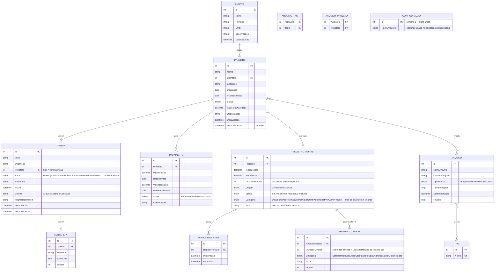

# Especificação do Projeto
## Sistema de Gestão para Escritório de Arquitetura — "J.R Studio"

*Nome de exibição do app: **J.R Studio** (derivado da marca do escritório, Jéssica Rufino Arquitetura). Nome técnico usado no código/namespaces/pastas: **JRStudio** (sem pontuação, por ser inválido em namespaces C#).*

---

## 1. Visão Geral

Aplicativo desktop para Windows, desenvolvido em **C# / Blazor**, para uso individual de uma arquiteta autônoma. O objetivo é centralizar em um único lugar tudo que hoje está espalhado entre caderno físico, Google Drive, e-mail e Trello:

- Gestão de projetos e clientes
- Tarefas e lembretes com prazos
- Controle financeiro simples por projeto
- Rastreamento de horas trabalhadas (para cálculo de valor/hora cobrado)
- Biblioteca central de arquivos e ativos visuais (imagens, texturas, referências) reutilizáveis entre projetos

**Usuário:** uso individual (não multiusuário).
**Plataforma:** aplicativo desktop nativo para Windows.
**Armazenamento:** banco de dados local, **decisão definitiva** — não há necessidade de sincronização em nuvem, já que o uso será concentrado em um único computador. Para o cenário eventual de trocar de computador, a função de Backup e Restauração (ver 2.7) resolve isso manualmente.

---

## 2. Módulos e Funcionalidades

### 2.1 Gestão de Projetos (módulo central)

Todo o restante do sistema gira em torno do "Projeto" como entidade principal.

- Cadastro de projetos: nome, cliente, endereço/local da obra, data de início, prazo estimado, valor total acordado, status (Orçamento, Em andamento, Pausado, Concluído)
- O campo **Cliente** é preenchido como texto livre diretamente na criação do projeto — não exige um cadastro de cliente separado antes de começar um projeto (o modelo de dados pode continuar normalizando isso como entidade `Cliente` internamente, mas o fluxo de uso não bloqueia nisso)
- Vincular tarefas, financeiro, horas e arquivos a um projeto específico
- **Listagem de projetos com filtros em formato de chips** (mesmo padrão visual da Biblioteca de Arquivos), cada um exibindo a contagem de projetos: Em andamento, Concluídos, Orçamento, Pausado, e um chip do **ano atual** (reúne projetos em andamento + projetos concluídos naquele ano — recalculado dinamicamente a partir da data do sistema, não fixo)
- **Menu de ações rápidas por card** (ícone de três pontos no canto do card): Editar e Excluir, sem precisar abrir o projeto primeiro. Excluir exige confirmação
- Editar um projeto reutiliza o mesmo formulário de criação, pré-preenchido
- Tela de "resumo do projeto" (aba Visão Geral) reunindo saldo financeiro, horas trabalhadas/valor-hora e a próxima parcela a vencer daquele projeto

### 2.2 Tarefas & Lembretes

- Criar tarefas dentro de um projeto (ou tarefas avulsas, não ligadas a projeto)
- **O quadro de tarefas de cada projeto é dividido em 4 fases fixas**, refletindo as etapas do processo de projeto arquitetônico: **Pré-projeto, Estudo preliminar, Anteprojeto e Projeto executivo**
  - Cada fase tem seu próprio mini-quadro com as 3 colunas (A fazer / Fazendo / Concluído) e sua própria contagem de tarefas
  - Cada fase é **colapsável independentemente** — colapsada, mostra só o título e a contagem, sem ocupar espaço com as colunas
  - As 4 fases são criadas automaticamente e na mesma ordem para todo novo projeto; nesta versão não são renomeáveis nem removíveis (a estrutura é fixa) — apenas as tarefas dentro delas são editáveis
  - Tarefas avulsas (não ligadas a um projeto) não passam por essa divisão de fases, já que ela só faz sentido no contexto de um projeto
- Subtarefas/checklist dentro de uma tarefa
- Prioridade (baixa/média/alta) e prazo (data e, opcionalmente, hora)
- **Menu de ações por card de tarefa** (ícone de três pontos no próprio card): Editar e Excluir — mesmo padrão de interação usado nos cards de projeto (ver 2.1), só que aplicado à tarefa individual, não à fase
- Notificações nativas do Windows quando um prazo se aproxima
- Visão em lista e visão em calendário
- Marcar como concluída, adiar (snooze), recorrência simples (ex: "toda segunda")

### 2.3 Financeiro (simples, por projeto)

Nível de detalhe: **simples e direto**, sem contabilidade complexa.

- Valor total acordado do projeto
- Registro de pagamentos recebidos: valor, data recebida (ou data prevista, se ainda não pago)
- Cálculo automático de "quanto falta receber"
- Lista/calendário de parcelas a receber com data prevista
- Alerta de parcela próxima do vencimento ou vencida
- Visão consolidada: total a receber no mês, entre todos os projetos

*Fora do escopo v1 (mas já pensado para o modelo de dados não travar isso no futuro): despesas detalhadas, notas fiscais, relatório de lucratividade completo.*

### 2.4 Rastreamento de Horas (diferencial específico)

Objetivo: permitir que ela descubra quanto está ganhando por hora em cada projeto, para refinar sua precificação com o tempo. Hoje ela usa o relógio do próprio Windows para se controlar — a ideia é substituir isso por um cronômetro integrado ao app, já vinculado ao projeto certo.

- **Cronômetro integrado (start/pause/stop):**
  - O cronômetro é **único e global ao aplicativo** — apenas uma sessão ativa por vez — e fica **permanentemente visível na barra lateral**, em qualquer tela do app, não só dentro do projeto
  - Pode ser iniciado de dois lugares: de dentro da aba "Horas" de um projeto (já associado a ele automaticamente), ou direto pela barra lateral
  - Se iniciado pela barra lateral sem um projeto em contexto (ex: estando no Dashboard ou na Biblioteca), o app abre um **seletor rápido de projeto** ali mesmo, antes de começar a contar
  - Botão "Iniciar" começa a contagem; "Pausar" congela sem finalizar (útil se ela for interrompida); "Parar/Concluir" finaliza e salva o registro
  - Cronômetro visível mesmo com o app minimizado — via ícone na bandeja do sistema (system tray), mostrando o tempo decorrido ao passar o mouse ou em um mini pop-up
  - Ao concluir, mostra um resumo ("Você trabalhou 2h35 no Projeto X") com opção de adicionar uma **categoria** e uma nota rápida
  - Se tentar iniciar outro projeto com um cronômetro já ativo, o app avisa e pergunta se quer parar o atual primeiro
  - Caso esqueça o cronômetro rodando, o app pode alertar após X horas de inatividade/tempo excessivo, perguntando se ela realmente ainda está trabalhando naquilo
- **Categorização do tipo de trabalho**: cada sessão (do cronômetro ou manual) pode ser marcada com uma categoria — Detalhamento, Projeto, Reunião com cliente, Visita a obra, Administrativo, Outro — além de uma nota livre. As categorias são uma lista fixa e curta nesta versão, pensada pra dar uma visão rápida de "em que tipo de atividade o tempo foi gasto", sem virar uma ferramenta de controle de ponto detalhada. *(Categoria "Projeto" adicionada após a implementação inicial, a pedido da usuária; no enum `CategoriaHoras` ela fica no fim, depois de `Outro`, para não renumerar o valor inteiro de categorias já persistidas no banco — EF Core grava enum como int por padrão.)*
- **Editar e dividir uma sessão já registrada**: ao editar um registro de horas, além de corrigir duração/categoria/nota, é possível **dividir aquele período em vários trechos**, cada um com sua própria duração, categoria e nota — por exemplo, transformar uma sessão única de "3h20 no Projeto X" em "1h de reunião com cliente" + "2h20 de detalhamento elétrico". A soma dos trechos sempre precisa bater com a duração total da sessão original
- **Registro manual** (alternativa/complemento ao cronômetro): opção de digitar horas trabalhadas diretamente para um dia/projeto, já podendo dividir em trechos com categorias desde a criação, para casos em que ela esqueceu de rodar o cronômetro
- Totalizador de horas por projeto (diário/semanal/mensal/total do projeto), com possibilidade de ver o total agrupado por categoria também
- Histórico de sessões: lista de todos os registros de tempo por projeto, com data, duração, categoria(s) e nota(s), editável caso precise corrigir algo
- Cálculo automático: **valor do projeto ÷ total de horas trabalhadas = valor efetivo da hora**
- Comparativo entre projetos (ex: "no projeto X sua hora saiu a R$ Y, no projeto Z saiu a R$ W") para ajudar a calibrar orçamentos futuros

### 2.5 Biblioteca de Arquivos e Ativos (ponto forte do sistema)

Este módulo resolve o problema de "onde guardei aquela textura/imagem que usei antes":

- Repositório central de arquivos (imagens, texturas, referências, PDFs, etc.), independente de projeto
- Cada arquivo pode ser vinculado a **um ou mais projetos** E receber **tags reutilizáveis** (ex: "madeira", "piso porcelanato", "fachada moderna", "iluminação indireta")
- Busca e filtro por tag, tipo de arquivo, ou projeto de origem
- Visualização em grade com miniaturas/preview de imagens
- Marcar arquivos como favoritos/mais usados
- Import fácil (arrastar e soltar pastas inteiras) e organização automática por data de importação

### 2.6 Dashboard Inicial

Tela de abertura do app, com visão geral do dia:

- Tarefas com prazo hoje/essa semana
- Parcelas a receber próximas do vencimento
- Atalho rápido para "iniciar timer" de horas no projeto ativo
- Projetos em andamento e seu status

### 2.7 Backup e Restauração Completa

Como os dados vivem localmente (banco SQLite + pasta de arquivos importados), o app precisa de uma forma simples de mover **todo o estado do sistema** de um computador para outro — não só o banco, mas também as imagens/texturas da Biblioteca.

O botão de backup oferece **duas opções**, pensadas pra situações diferentes:

1. **Backup completo** — banco de dados **+** toda a pasta de arquivos importados (imagens, texturas, referências). Use esse quando for trocar de computador ou quando quiser uma cópia de segurança de tudo, sem exceções. Tende a ser um arquivo maior, já que carrega os arquivos da Biblioteca junto
2. **Backup só dos dados de gestão** — apenas o banco de dados (projetos, clientes, tarefas, financeiro, horas registradas), **sem** os arquivos da Biblioteca. Gera um arquivo bem mais leve e rápido de fazer — útil pra backups frequentes/rotineiros do que realmente muda todo dia, sem precisar reempacotar imagens que raramente mudam

Detalhes comuns às duas opções:

- Ao clicar em "Fazer backup", a pessoa escolhe qual das duas opções quer, depois escolhe onde salvar o arquivo `.zip` gerado (ex: `JRStudio-backup-completo-2026-09-13.zip` ou `JRStudio-backup-dados-2026-09-13.zip`) — pen drive, HD externo, uma pasta do Google Drive, etc. O app só gera o pacote, não gerencia onde ele fica guardado
- **Restaurar backup**: a pessoa seleciona um arquivo `.zip` gerado por qualquer uma das duas opções e o app identifica automaticamente qual tipo de backup é
  - Se for um backup **completo**, restaura banco de dados e arquivos, recriando o sistema exatamente como estava
  - Se for um backup **só de dados**, restaura apenas o banco de dados — os vínculos e tags de arquivos continuam no banco restaurado, mas os arquivos físicos em si (imagens/texturas) não estarão presentes, a menos que já existam naquele computador. O app avisa sobre essa diferença durante a restauração
- Restaurar um backup **substitui integralmente** os dados locais correspondentes — o app exige uma confirmação explícita antes de prosseguir, deixando claro que essa ação não pode ser desfeita
- Essa função fica em uma tela de **Configurações**, acessível por um ícone dedicado (ex: engrenagem) na barra lateral — não é uma ação do dia a dia, então não ocupa um dos destinos principais de navegação (ver 2.8)

*Nota: dado o quanto essa função importa para a segurança dos dados e para o cenário de troca/uso em mais de um computador, vale considerar implementá-la já na Fase 1 ou 2 do roadmap (ver Seção 9), em vez de deixá-la só para a Fase 4.*

### 2.8 Navegação Principal

Confirmado no protótipo: a barra lateral fixa tem apenas **3 destinos de primeiro nível** — Dashboard, Projetos e Biblioteca — em vez de um item de menu para cada módulo. Tarefas e Financeiro **não têm uma tela global própria**; são acessados sempre a partir de um projeto específico (abas dentro do Detalhe do Projeto). Essa simplificação evita duplicar visões e mantém o app enxuto para uso individual. Se no futuro surgir a necessidade de uma visão consolidada de tarefas ou financeiro entre todos os projetos, o Dashboard já cumpre parcialmente esse papel — uma tela dedicada pode ser avaliada depois, com base no uso real.

Além desses 3 destinos, um ícone de **Configurações** (engrenagem) fica disponível separadamente na barra lateral — é onde vive o Backup e Restauração (2.7) e outras preferências futuras do app, sem competir por atenção com a navegação do dia a dia.

A barra lateral também hospeda o indicador fixo do cronômetro (ver 2.4), sempre visível independente da tela atual.

### 2.9 Logs e Diagnóstico (infraestrutura interna) — ✅ Implementado (Fase 0)

Como o aplicativo roda 100% localmente, sem telemetria remota, o arquivo de log é a única fonte de diagnóstico quando algo dá errado na máquina da usuária. Não é uma tela/feature visível para ela — é infraestrutura técnica, por isso não aparece na navegação (2.8).

- Todo evento relevante de execução é registrado em arquivo de texto, gravado em `%AppData%\JRStudio\Logs\JRStudio_logs.txt`
- O arquivo ativo é sempre `JRStudio_logs.txt`; ao atingir ~5 MB ele é arquivado (renomeado com sufixo numérico) e um novo é iniciado — até 10 arquivos arquivados são mantidos, os mais antigos são descartados automaticamente, para o log não crescer indefinidamente
- Cada linha registra data/hora, nível, origem e mensagem (e stack trace, quando houver exceção)
- **Níveis usados** (detalhamento prático de "o que e quando logar" está no `Guia_Implementacao_IA.md`):
  - `Information` — ciclo de vida do app (abrir/fechar), migração do banco, e ações de negócio relevantes (criar/editar/excluir projeto, iniciar/parar cronômetro, gerar/restaurar backup)
  - `Warning` — situações recuperáveis que merecem atenção (ex: falha ao gerar thumbnail de um arquivo)
  - `Error` — exceções tratadas (o app captura e continua rodando)
  - `Fatal` — exceções não tratadas que derrubam o app; sempre gravadas antes do encerramento
  - Logs de bibliotecas de terceiros (EF Core, etc.) só aparecem a partir de `Warning`, para não poluir o arquivo com o SQL de cada consulta
- Dados sensíveis não são gravados em texto livre sem necessidade — preferir logar identificadores (ex: `ProjetoId`) em vez do conteúdo completo de campos de texto livre da usuária
- **Implementação técnica:** `Serilog`, configurado em `Jess.Infrastructure/Logging/LoggingSetup.cs` e plugado ao host de DI em `Jess.Desktop/App.xaml.cs`; exceções não tratadas (`AppDomain.UnhandledException`, `DispatcherUnhandledException`, `TaskScheduler.UnobservedTaskException`) são capturadas e logadas como `Fatal`/`Error` antes do app fechar ou continuar

---

## 3. Requisitos Não Funcionais

- Funciona 100% offline (sem dependência de internet para uso diário)
- Banco de dados local, com **função integrada de backup/restauração completa** (banco + arquivos em um único pacote — ver 2.7), não apenas cópia manual de pasta
- Interface simples e objetiva — usuária não é técnica, prioridade em fluidez sobre configurabilidade
- Performance leve, mesmo com muitas imagens armazenadas na biblioteca de arquivos — **estimativa de volume**: por projeto, algo entre poucas dezenas e algumas centenas de imagens (a maioria com poucos MB cada) e cerca de uma dezena de outros arquivos (PDFs, documentos). Somado ao longo de vários projetos ao longo do tempo, a Biblioteca pode acumular alguns milhares de itens no total — o suficiente para justificar geração de miniaturas (thumbnails) para a grade carregar rápido, mas sem exigir otimizações de escala muito além disso
- Deve reconhecer notificações do Windows mesmo com o app minimizado/na bandeja do sistema
- Todo erro ou evento relevante de execução é registrado em arquivo de log local, com rotação automática (ver 2.9), para permitir diagnóstico sem depender de conexão remota ou telemetria

---

## 4. Fora do Escopo (versão 1)

Para manter o projeto viável, os itens abaixo ficam propositalmente de fora da primeira versão, podendo entrar em fases futuras:

- Multiusuário / colaboração com funcionários ou parceiros
- Portal de acesso para clientes
- Sincronização em nuvem entre dispositivos
- Integração direta com softwares de CAD/BIM (Revit, SketchUp, AutoCAD)
- Aplicativo mobile
- Emissão de notas fiscais / integração contábil

---

## 5. Stack Técnica Proposta

- **.NET 8/9** com **Blazor Hybrid** (hospedado em WPF ou .NET MAUI), para ter aparência e comportamento de app desktop nativo
- **SQLite + Entity Framework Core** como banco de dados local
- Biblioteca de notificações nativas do Windows (toast notifications)
- Armazenamento de arquivos de imagem/textura no sistema de arquivos local, com metadados (tags, vínculos a projeto) no banco SQLite
- **Serilog** (sink de arquivo) para logging estruturado local em `JRStudio_logs.txt` (ver 2.9) — ✅ já implementado

---

## 6. Modelo de Dados Detalhado (Entidades e Relacionamentos)

### 6.1 Diagrama de Relacionamentos



### 6.2 Detalhamento das Tabelas

**Cliente**
| Campo | Tipo | Observação |
|---|---|---|
| Id | int (PK) | |
| Nome | string | obrigatório |
| Telefone | string | opcional |
| Email | string | opcional |
| Observacoes | text | livre |
| DataCadastro | datetime | preenchido automaticamente |

**Projeto**
| Campo | Tipo | Observação |
|---|---|---|
| Id | int (PK) | |
| Nome | string | obrigatório |
| ClienteId | int (FK → Cliente) | obrigatório |
| Endereco | string | endereço da obra |
| DataInicio | date | |
| PrazoEstimado | date | opcional |
| Status | enum | Orçamento, Em Andamento, Pausado, Concluído |
| ValorTotalAcordado | decimal | usado no cálculo de valor/hora |
| Observacoes | text | livre |
| DataCriacao | datetime | automático |
| DataConclusao | datetime, nullable | preenchido automaticamente quando `Status` muda para Concluído; zerado se voltar para outro status. Adicionado na Fase 1 (não estava na versão original desta tabela) para viabilizar o chip de filtro "ano atual" da Seção 2.1, que precisa saber a que ano pertence a conclusão de cada projeto |

**Tarefa**
| Campo | Tipo | Observação |
|---|---|---|
| Id | int (PK) | |
| Titulo | string | obrigatório — usado na captura rápida |
| Descricao | text | opcional, preenchido depois |
| ProjetoId | int (FK → Projeto), nullable | nulo = tarefa avulsa |
| Fase | enum, nullable | Pré-projeto, Estudo preliminar, Anteprojeto, Projeto executivo — obrigatório se `ProjetoId` estiver preenchido; nulo para tarefas avulsas. As 4 fases são fixas (criadas automaticamente para todo projeto) e não são renomeáveis/removíveis nesta versão |
| Prioridade | enum | Baixa, Média, Alta |
| Prazo | datetime, nullable | dispara notificação/lembrete |
| Coluna | enum | A Fazer, Fazendo, Concluído (visão Kanban) |
| RegraRecorrencia | string, nullable | ex: "toda segunda" — v1 pode ser texto simples |
| DataCriacao | datetime | automático |
| DataConclusao | datetime, nullable | preenchido ao concluir |

**Subtarefa**
| Campo | Tipo | Observação |
|---|---|---|
| Id | int (PK) | |
| TarefaId | int (FK → Tarefa) | |
| Descricao | string | item do checklist |
| Concluida | bool | |
| Ordem | int | ordenação manual |

**Pagamento**
| Campo | Tipo | Observação |
|---|---|---|
| Id | int (PK) | |
| ProjetoId | int (FK → Projeto) | |
| ValorPrevisto | decimal | valor da parcela |
| DataPrevista | date | usado para alertas de vencimento |
| ValorRecebido | decimal, nullable | nulo até ser marcado como recebido |
| DataRecebimento | date, nullable | |
| Status | enum | Pendente, Recebido, Atrasado (calculado por data) — **não é uma coluna no banco**; calculado sob demanda a partir de `ValorRecebido`/`DataPrevista` toda vez que o pagamento é lido, para nunca ficar desatualizado (ver `FinanceiroCalculos.CalcularStatus`) |
| Observacoes | string | opcional |

**RegistroDeHoras**
| Campo | Tipo | Observação |
|---|---|---|
| Id | int (PK) | |
| ProjetoId | int (FK → Projeto) | |
| InicioSessao | datetime | quando o cronômetro foi iniciado (ou horário digitado manualmente) |
| FimSessao | datetime, nullable | nulo enquanto em andamento |
| DuracaoMinutos | int | calculado a partir de início/fim menos pausas |
| Origem | enum | Cronômetro, Manual |
| Status | enum | Em Andamento, Pausado, Concluído |
| Categoria | enum, nullable | Detalhamento, Projeto, Reunião com cliente, Visita a obra, Administrativo, Outro. Nulo quando a sessão foi dividida em trechos (ver `SegmentoHoras`) — nesse caso a categoria vive em cada trecho, não no registro pai |
| Nota | string, nullable | nulo quando dividida em trechos, pelo mesmo motivo acima |

**SegmentoHoras**
| Campo | Tipo | Observação |
|---|---|---|
| Id | int (PK) | |
| RegistroHorasId | int (FK → RegistroDeHoras) | |
| DuracaoMinutos | int | a soma de todos os trechos de um registro deve ser igual ao `DuracaoMinutos` do registro pai — validado ao salvar |
| Categoria | enum | Detalhamento, Projeto, Reunião com cliente, Visita a obra, Administrativo, Outro |
| Nota | string, nullable | |
| Ordem | int | ordem de exibição dos trechos dentro da sessão |

*Uma sessão sem divisão usa `Categoria`/`Nota` diretamente no `RegistroDeHoras`. Ao ser dividida (editada em mais de um trecho), esses dois campos do registro pai são zerados e a informação passa a viver em `SegmentoHoras` — evita duplicidade de onde a categoria "mora".*

**PausaRegistroHoras**
| Campo | Tipo | Observação |
|---|---|---|
| Id | int (PK) | |
| RegistroHorasId | int (FK → RegistroDeHoras) | |
| InicioPausa | datetime | |
| FimPausa | datetime, nullable | nulo se ainda pausado |

*Uma sessão pode ter várias pausas — a duração final desconta a soma de todos os intervalos pausados.*

**Arquivo**
| Campo | Tipo | Observação |
|---|---|---|
| Id | int (PK) | |
| NomeArquivo | string | |
| CaminhoArquivo | string | caminho no sistema de arquivos local |
| TipoArquivo | enum | Imagem, Textura, PDF, Documento, Outro |
| TamanhoBytes | long | |
| DataImportacao | datetime | |
| Favorito | bool | |

**Tag**
| Campo | Tipo | Observação |
|---|---|---|
| Id | int (PK) | |
| Nome | string (único) | reutilizável entre arquivos e projetos |

**ArquivoTag** (tabela associativa N:N)
| Campo | Tipo |
|---|---|
| ArquivoId | int (FK → Arquivo) |
| TagId | int (FK → Tag) |

**ArquivoProjeto** (tabela associativa N:N — um arquivo pode ter sido usado em vários projetos)
| Campo | Tipo |
|---|---|
| ArquivoId | int (FK → Arquivo) |
| ProjetoId | int (FK → Projeto) |

**Configuracao** *(adicionada fora do modelo original — ver nota abaixo)*
| Campo | Tipo | Observação |
|---|---|---|
| Id | int (PK) | sempre `1`; a tabela nunca tem mais de uma linha (get-or-create em `IConfiguracaoRepository.ObterOuCriarAsync`) |
| NomeArquiteto | string, nullable | usado na saudação do Dashboard ("Bom dia, {nome}"); editável na tela Configurações → Perfil |

*Adicionada a pedido da usuária pra parar de exibir "Bom dia" sem nome na saudação do Dashboard, sem fazer isso como texto fixo no código. É deliberadamente uma tabela mínima (não um cadastro de usuário/autenticação) — a usuária já sinalizou que um cadastro de usuário mais completo é uma necessidade futura; quando ele for implementado, essa tabela tende a ser absorvida ou renomeada, não fica como está pra sempre.*

### 6.3 Regras de Negócio Derivadas do Modelo

- **Saldo do projeto** = `Projeto.ValorTotalAcordado − SOMA(Pagamento.ValorRecebido)`
- **Valor efetivo da hora** = `Projeto.ValorTotalAcordado ÷ (SOMA(RegistroDeHoras.DuracaoMinutos) ÷ 60)`
- **Status do Pagamento** = calculado automaticamente: `Atrasado` se `DataPrevista < hoje` e `ValorRecebido` nulo; `Recebido` se `ValorRecebido` preenchido; senão `Pendente`
- Excluir um `Projeto` não deve excluir `Arquivo`s vinculados (só remove o vínculo em `ArquivoProjeto`), já que o arquivo pode ser reaproveitado em outros projetos
- **Divisão de sessão em trechos**: ao salvar um `RegistroDeHoras` com `SegmentoHoras` associados, a soma de `SegmentoHoras.DuracaoMinutos` deve ser exatamente igual ao `DuracaoMinutos` do registro pai — o app impede salvar caso não bata, e sugere ajustar o último trecho automaticamente para fechar a conta

---

## 7. Estrutura do Projeto em C#/Blazor

### 7.1 Escolha de Arquitetura Física

Recomenda-se **WPF host + BlazorWebView** (em vez de .NET MAUI) pois o app é exclusivamente Windows — evita a camada extra de abstração multiplataforma do MAUI e facilita recursos nativos do Windows já previstos no escopo (ícone na bandeja do sistema, notificações toast).

Arquitetura em camadas (Clean Architecture simplificada), separando regras de negócio da interface:

*Nota: no código real, os projetos de classe usam o prefixo `Jess` em vez de `JRStudio`, e o projeto de entidades chama-se `Jess.Entities` (não `Domain`) — ex.: `Jess.Entities`, `Jess.Application`, `Jess.Infrastructure`, `Jess.UI`, `Jess.Desktop`. A árvore abaixo mantém a nomenclatura original do documento; onde houver divergência de nome, o código é a referência.*

```
JRStudio.sln
│
├── src/
│   ├── JRStudio.Domain/              → Entidades e regras puras, sem dependências externas
│   │   ├── Entities/
│   │   │   ├── Cliente.cs
│   │   │   ├── Projeto.cs
│   │   │   ├── Tarefa.cs
│   │   │   ├── Subtarefa.cs
│   │   │   ├── Pagamento.cs
│   │   │   ├── RegistroDeHoras.cs
│   │   │   ├── PausaRegistroHoras.cs
│   │   │   ├── SegmentoHoras.cs
│   │   │   ├── Arquivo.cs
│   │   │   └── Tag.cs
│   │   ├── Enums/
│   │   │   ├── StatusProjeto.cs
│   │   │   ├── PrioridadeTarefa.cs
│   │   │   ├── ColunaTarefa.cs
│   │   │   ├── FaseProjeto.cs
│   │   │   ├── StatusPagamento.cs
│   │   │   ├── OrigemRegistroHoras.cs
│   │   │   ├── CategoriaHoras.cs
│   │   │   └── TipoArquivo.cs
│   │   └── Interfaces/                  → Contratos de repositório (implementados na Infrastructure)
│   │       ├── IClienteRepository.cs       (✅ implementado — ObterOuCriarPorNomeAsync, dado que Cliente é texto livre no formulário)
│   │       ├── IProjetoRepository.cs       (✅ implementado)
│   │       ├── ITarefaRepository.cs
│   │       ├── IPagamentoRepository.cs
│   │       ├── IRegistroDeHorasRepository.cs
│   │       └── IArquivoRepository.cs
│   │
│   ├── JRStudio.Application/         → Casos de uso / regras de negócio de aplicação
│   │   ├── Services/
│   │   │   ├── ProjetoService.cs
│   │   │   ├── TarefaService.cs
│   │   │   ├── FinanceiroService.cs        (saldo, status de pagamento)
│   │   │   ├── RastreamentoHorasService.cs (start/pause/stop, cálculo valor/hora)
│   │   │   ├── ArquivoService.cs           (import, tags, vínculos)
│   │   │   ├── NotificacaoService.cs       (agendamento de lembretes)
│   │   │   └── BackupService.cs            (orquestra backup/restauração via Infrastructure)
│   │   ├── DTOs/
│   │   │   ├── ProjetoDto.cs
│   │   │   ├── TarefaDto.cs
│   │   │   └── ...
│   │   └── Interfaces/
│   │       ├── IProjetoService.cs
│   │       └── ...
│   │
│   ├── JRStudio.Infrastructure/      → Implementações concretas (EF Core, arquivos, notificações)
│   │   ├── Data/
│   │   │   ├── AppDbContext.cs
│   │   │   ├── Migrations/
│   │   │   └── Repositories/
│   │   │       ├── ProjetoRepository.cs
│   │   │       ├── TarefaRepository.cs
│   │   │       └── ...
│   │   ├── FileSystem/
│   │   │   └── FileStorageService.cs    (cópia/organização física dos arquivos importados)
│   │   ├── Backup/
│   │   │   └── BackupService.cs         (gera/restaura .zip — modo completo ou só dados, ver 2.7)
│   │   ├── Notifications/
│   │   │   └── WindowsToastService.cs
│   │   ├── Logging/
│   │   │   └── LoggingSetup.cs          (configuração do Serilog: nível mínimo, sink de arquivo, rotação — ✅ implementado)
│   │   └── DependencyInjection.cs       (extension method: AddInfrastructure)
│   │
│   ├── JRStudio.UI/                  → Razor Class Library — todas as telas e componentes Blazor
│   │   ├── Pages/
│   │   │   ├── Dashboard.razor
│   │   │   ├── Projetos/
│   │   │   │   ├── ListaProjetos.razor
│   │   │   │   └── DetalheProjeto.razor
│   │   │   ├── Tarefas/
│   │   │   │   └── QuadroTarefas.razor      (Kanban)
│   │   │   ├── Financeiro/
│   │   │   │   └── Pagamentos.razor
│   │   │   ├── Horas/
│   │   │   │   └── Cronometro.razor
│   │   │   ├── Arquivos/
│   │   │   │   └── Biblioteca.razor
│   │   │   └── Configuracoes/
│   │   │       └── BackupRestauracao.razor
│   │   ├── Components/                  → componentes reutilizáveis
│   │   │   ├── TaskCard.razor
│   │   │   ├── ProjectCard.razor
│   │   │   ├── TimerWidget.razor
│   │   │   ├── FileThumbnail.razor
│   │   │   └── TagInput.razor
│   │   ├── Layout/
│   │   │   ├── MainLayout.razor
│   │   │   └── NavMenu.razor
│   │   └── wwwroot/
│   │       ├── css/app.css
│   │       └── js/interop.js            (drag&drop do Kanban, ticking do cronômetro)
│   │
│   └── JRStudio.Desktop/             → Ponto de entrada (host WPF)
│       ├── MainWindow.xaml              (hospeda o BlazorWebView)
│       ├── App.xaml.cs                  (configura DI, logging (Serilog), inicializa DB, tratamento global de exceções, tray icon — ✅ DI/logging/DB implementados)
│       ├── TrayIconService.cs           (ícone na bandeja + cronômetro visível)
│       └── appsettings.json
│
└── tests/
    ├── JRStudio.Domain.Tests/           → testes de entidades e regras puras
    ├── JRStudio.Application.Tests/      → testes dos Services (regra de negócio principal)
    └── JRStudio.Infrastructure.Tests/   → testes de repositórios contra SQLite em memória
```

### 7.2 Fluxo de Dependências

```
Desktop (WPF host)  →  UI (Razor components)  →  Application (services)  →  Domain (entidades/interfaces)
                                                         ↑
                                              Infrastructure (implementa interfaces do Domain)
```

- **Domain** não depende de nada — só regras e contratos
- **Application** depende só do Domain (usa as interfaces, não sabe que é SQLite)
- **Infrastructure** implementa as interfaces do Domain (Repository Pattern) e é injetada via DI
- **UI** consome os serviços da Application via injeção de dependência (`@inject`)
- **Desktop** é só o "casulo" que hospeda o BlazorWebView e registra tudo no container de DI

Essa separação facilita trocar SQLite por outro banco no futuro, ou até migrar para Blazor Server/MAUI sem reescrever regra de negócio — o `Domain` e a `Application` continuam intactos.

### 7.3 Observações Técnicas

- Banco SQLite salvo em `%AppData%\JRStudio\dados.db`, criado automaticamente na primeira execução (`DbContext.Database.Migrate()`) — ✅ implementado (Fase 0)
- Arquivos importados (imagens/texturas) copiados para `%AppData%\JRStudio\Arquivos\`, com o caminho salvo no banco
- Ícone na bandeja do sistema via biblioteca como `Hardcodet.NotifyIcon.Wpf`
- Notificações nativas via `Microsoft.Toolkit.Uwp.Notifications` (toast do Windows)
- Injeção de dependência configurada em `App.xaml.cs` usando `Microsoft.Extensions.Hosting` — ✅ implementado (Fase 0)
- Logs de execução gravados via Serilog em `%AppData%\JRStudio\Logs\JRStudio_logs.txt`, com rotação por tamanho (~5 MB, até 10 arquivos arquivados — ver 2.9) — ✅ implementado (Fase 0)

### 7.4 Testes Unitários

Dado que boa parte do valor do app está em **cálculos e regras de negócio** (saldo do projeto, valor efetivo da hora, status de pagamento, validação da soma de trechos de horas), essa é a área com maior retorno para testes automatizados — evita que um ajuste futuro quebre silenciosamente um cálculo que a usuária confia para tomar decisões financeiras.

**Stack de testes:**
- **xUnit** — framework de testes (padrão no ecossistema .NET moderno)
- **FluentAssertions** — deixa as asserções mais legíveis (`resultado.Should().Be(...)`)
- **NSubstitute** (ou Moq) — para simular (mock) repositórios e dependências externas nos testes de `Application`
- **EF Core InMemory** ou **SQLite em modo `:memory:`** — para testar repositórios reais da `Infrastructure` sem precisar de um banco de arquivo de verdade

**O que testar em cada projeto de teste:**

| Projeto de teste | Foco | Exemplos de casos |
|---|---|---|
| `JRStudio.Domain.Tests` | Regras que vivem nas próprias entidades, se houver (ex: validações simples) | Uma `Tarefa` sem `ProjetoId` não deve exigir `Fase` preenchida |
| `JRStudio.Application.Tests` | **Prioridade máxima** — a lógica de negócio dos `Services`, com repositórios mockados | - `FinanceiroService`: saldo do projeto = total − soma dos pagamentos recebidos<br>- `FinanceiroService`: status do pagamento calculado corretamente (Pendente/Recebido/Atrasado) conforme a data<br>- `RastreamentoHorasService`: valor efetivo da hora = valor do projeto ÷ horas trabalhadas<br>- `RastreamentoHorasService`: **a soma dos trechos (`SegmentoHoras`) deve sempre bater com a duração total do registro** — testar o caso de dividir uma sessão e o caso de tentar salvar uma soma inconsistente<br>- `ProjetoService`: criar um projeto novo já gera as 4 fases padrão automaticamente, na ordem certa<br>- `ArquivoService`: excluir um projeto não deve excluir os arquivos vinculados a ele, só o vínculo |
| `JRStudio.Infrastructure.Tests` | Repositórios batendo num banco SQLite em memória (não mockado) | - Consultas com filtros (ex: buscar tarefas por fase) retornam o esperado<br>- Migrations aplicam corretamente o schema<br>- `BackupService`: gerar e depois restaurar um backup (completo e só-dados) resulta no mesmo estado de dados |

**O que **não** é prioridade testar** (não compensa o esforço para um app de uso individual):
- Componentes visuais Blazor (`.razor`) — mudam muito durante o desenvolvimento e têm baixo risco de regressão silenciosa
- Código do `Desktop` (WPF host, tray icon) — mais fácil de verificar manualmente do que automatizar

**Convenção de nomes dos testes:** `NomeDoMetodo_Cenario_ResultadoEsperado`, por exemplo: `CalcularSaldo_ComPagamentosParciais_RetornaValorRestante`.

**Quando rodar:** os testes de `Domain` e `Application` devem rodar em segundos (sem I/O real) e podem ser executados a cada build; os de `Infrastructure` podem ser um pouco mais lentos (banco em memória) e rodar antes de cada release/merge.

---

## 8. Referência de Interface — Protótipo Funcional

A interface deste aplicativo **não está descrita em wireframes de texto**. Em vez disso, existe um **protótipo funcional e navegável**, construído em HTML/CSS/JS autocontido, que implementa (com dados de exemplo) todas as telas e fluxos descritos neste documento: barra lateral, Dashboard, Lista de Projetos com filtros e menu de ações, Detalhe do Projeto com as 5 abas, cronômetro global funcional, modal de criação/edição de projeto, e Biblioteca de Arquivos com filtro por tags.

**Link do protótipo:**
https://claude.ai/code/artifact/62d07daa-835f-48a4-be65-d5958ee6d475

O protótipo é uma referência de **UX e estrutura de telas**, não de arquitetura de código — ele não segue a separação em camadas descrita na Seção 7 (Domain/Application/Infrastructure/UI/Desktop) nem usa Blazor; é apenas HTML/JS para validar o design antes da implementação real em C#/Blazor.

---

## 9. Roadmap Sugerido (Fases)

| Fase | Escopo | Status |
|------|--------|--------|
| **Fase 0 — Scaffolding** | Estrutura de projetos/solution (Seção 7.1), referências entre camadas, app WPF+BlazorWebView abrindo, `AppDbContext` + SQLite com migração automática, e infraestrutura de logging (Serilog, ver 2.9) — detalhamento em `Guia_Implementacao_IA.md` | ✅ **Implementado** |
| **Fase 1 — MVP** | Gestão de Projetos + Tarefas & Lembretes + Dashboard básico | ✅ **Implementado** — Tarefas & Lembretes acabou sendo entregue na Fase 2.1 (dependia da estrutura de Fases do projeto); com isso concluído, a Fase 1 está completa |
| **Fase 2** | Financeiro simples (pagamentos/parcelas) + Rastreamento de Horas + cálculo de valor/hora + **Backup e Restauração completa** (movido para cá dada sua importância para segurança dos dados) | ✅ **Implementado** |
| **Fase 3** | Biblioteca de Arquivos e Ativos com tags e busca | ✅ **Implementado** (sem drag-and-drop nem geração de thumbnail redimensionada — ver `Guia_Implementacao_IA.md`) |
| **Fase 4** | Refinamentos: notificações toast, ícone de bandeja, ajustes de UX com base no uso real | 🟡 Notificações e bandeja ✅ implementadas — ajustes de UX e revisão de performance seguem pendentes (dependem de uso real, ver `Guia_Implementacao_IA.md`) |

---

## 10. Pontos em Aberto para Definir Depois

Todos os pontos levantados na primeira versão deste documento foram resolvidos em conversas de acompanhamento:
- ✅ Nome do app: **J.R Studio**
- ✅ Sincronização em nuvem: não será necessária — uso local em um único computador, com Backup e Restauração (2.7) cobrindo o cenário de trocar de máquina
- ✅ Categorização de horas: sim, com categorias fixas + possibilidade de dividir uma sessão em trechos (2.4)
- ✅ Volume de arquivos: estimado em dezenas a poucas centenas de imagens por projeto (ver Seção 3)

---

*Documento gerado como base inicial de escopo — recomenda-se revisão conjunta antes do início do desenvolvimento.*
